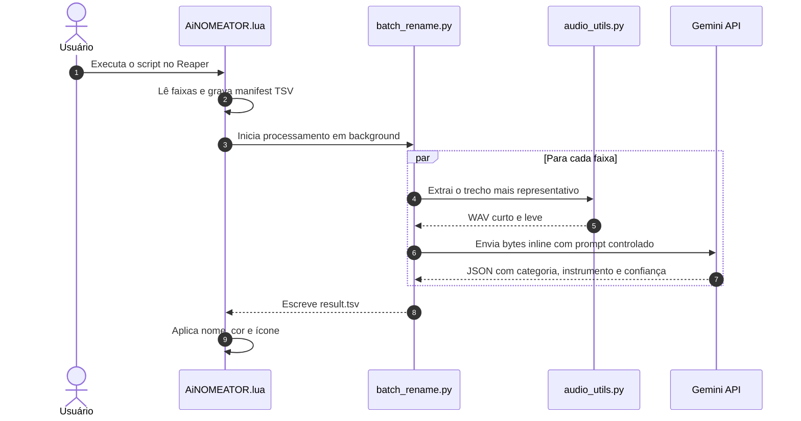

<p align="center">
  
</p>

# AiNOMEATOR

Identifica automaticamente o instrumento principal de cada faixa no Reaper usando Gemini, e aplica nome, cor e ícone — com interface gráfica e processamento em background para não travar o DAW.

> [!NOTE]
> O projeto tem duas etapas: validação local da IA via Python, e integração final no Reaper via ReaScript. Primeiro calibre a classificação no terminal; depois use o pipeline dentro do DAW.

## Visão geral



O pipeline prioriza trechos curtos e representativos para reduzir custo, latência e ruído de contexto. O áudio enviado à API é reduzido localmente para um segmento de maior energia, convertido para mono e reamostrado para 24 kHz antes da requisição.

## Recursos principais

- Classificação de áudio individual ou em lote.
- Interface gráfica no Reaper (EN/PT) com progresso em tempo real.
- Integração sem bloquear a UI do DAW.
- Paralelismo com `ThreadPoolExecutor` para chamadas à API (I/O-bound).
- Fallback automático de modelos Gemini quando um falha ou fica indisponível.
- Paleta de cores personalizável via arquivo `.ini` ou prompt de IA.
- Sincronização opcional com SWS Auto Color.
- Saída padronizada em TSV para troca simples entre Lua e Python.
- Ferramentas de validação local (`test_single.bat`, `test_batch.bat`) antes de usar no DAW.

## Capturas de tela

<p align="center">
  
  <br />
  <em>Interface do script — configuração de análise, cores e API key</em>
</p>

<p align="center">
  
  <br />
  <em>Resultado aplicado nas faixas — nomes, cores e ícones gerados pela IA</em>
</p>

## Requisitos

- Python 3.9+ no PATH
- Chave da API Gemini
- Reaper para a etapa de integração com `AiNOMEATOR.lua`
- Extensão SWS (opcional, para colar a API key com Ctrl+V e sincronizar cores)

> [!TIP]
> Para testar só a IA, não precisa abrir o Reaper. Use `classify_track.py` e `test_batch.py` com arquivos de áudio na pasta `samples/`.

## Instalação

1. Extraia o repositório para uma pasta local, ex.: `C:\reaper-ainomeator`.
2. Execute `setup.bat`.
   - Cria o ambiente virtual.
   - Instala as dependências.
   - Cria um arquivo `.env` na raiz do projeto.
3. Abra `.env` e configure sua chave:

```env
GEMINI_API_KEY=sua_chave_aqui
```

A chave também pode ser informada diretamente na interface do script no Reaper.

## Início rápido

### 1. Testar um arquivo de áudio

Use `test_single.bat` com um áudio curto, ou execute diretamente:

```bash
python classify_track.py "C:\caminho\para\audio.wav"
```

Por padrão o script busca um segmento de 8 segundos com maior energia, gera uma versão leve e só então envia os bytes ao Gemini.

Opções úteis:

- `--full`: analisa o arquivo inteiro (geralmente só para comparação).
- `--segment-seconds N`: define o tamanho do segmento analisado.
- `--keep-segment`: mantém os WAVs temporários para inspeção.
- `--models a,b,c`: define a ordem de fallback dos modelos.
- `--output-language pt|en`: idioma do nome do instrumento.

### 2. Validar em lote

Coloque amostras em `samples/`, preencha o `GABARITO` em `test_batch.py` e execute `test_batch.bat`.

Isso mostra se o prompt está consistente. Se a precisão for baixa, ajuste o prompt em `classify_track.py` ou no arquivo opcional `analysis_prompt.txt`.

### 3. Rodar no Reaper

Carregue `AiNOMEATOR.lua` como ReaScript:

1. `Actions > Show action list...`
2. `New action... > Load ReaScript...`
3. Selecione `AiNOMEATOR.lua`

A interface oferece:

- Analisar todas as faixas ou apenas as selecionadas.
- Modo rápido (3 picos de áudio em MP3 128 kbps) ou detalhado (remove silêncios, envia WAV).
- Duração de análise por faixa (padrão: 8 segundos).
- Threads paralelas (padrão: 5).
- Prompt de cores personalizado (gera paleta via IA).
- Chave da API Gemini (salva no `.env`).
- Interface em português ou inglês.

O script prefere o Python do venv. Se o venv não existir, usa o Python do sistema e exibe avisos no console do Reaper.

### 4. Sincronizar cores com SWS (opcional)

Execute `AiNOMEATOR_sws_sync.lua` no Reaper (ou `sync_sws_colors.bat` fora do DAW) para copiar a paleta de `reaper_ai_track_namer_colors.ini` para o `sws-autocoloricon.ini` do Reaper.

## Como funciona

### Etapa 1: Reaper coleta contexto

O ReaScript varre as faixas do projeto, encontra o item de mídia mais representativo e grava um manifest TSV:

```tsv
idx	audio_path	start_seconds	duration_seconds
```

Faixas MIDI, vazias ou sem fonte de áudio são ignoradas.

### Etapa 2: Python processa e chama a IA

`batch_rename.py` lê o manifest, distribui as faixas entre threads e chama `classify_track.py` para cada entrada. O resultado volta em outro TSV:

```tsv
idx	status	category	instrument	confidence	error
```

`status` pode ser `ok` ou `error`. Se algo falhar, o restante do lote continua.

### Etapa 3: Reaper aplica o resultado

Após ler o TSV, o script:

- renomeia a faixa;
- aplica cor coerente com a categoria;
- tenta encontrar um ícone correspondente entre os ícones nativos do Reaper.

## Modos de análise

- **Rápido**: combina três picos de energia em MP3 leve a 128 kbps.
- **Detalhado**: remove silêncios e envia WAV mais fiel.

## Personalização de cores

Edite `reaper_ai_track_namer_colors.ini` manualmente (formato `chave = #HEX`) ou use o campo de prompt de cores na interface para gerar uma paleta via IA. O arquivo gerado por prompt é salvo como `reaper_ai_track_namer_colors_prompt.ini`.

## Arquitetura de arquivos

```text
reaper-ainomeator/
├── AiNOMEATOR.lua              # Integração com Reaper (UI + aplicação de resultados)
├── AiNOMEATOR_sws_sync.lua     # Atalho ReaScript para sincronizar cores com SWS
├── batch_rename.py             # Processamento em lote e orquestração
├── classify_track.py           # Classificação com Gemini
├── audio_utils.py              # Extração de trechos, limpeza e resample
├── sync_sws_colors.py          # Sincroniza paleta com SWS Auto Color
├── test_batch.py               # Validação local com gabarito
├── setup.bat                   # Cria venv e .env
├── sync_sws_colors.bat         # Atalho para sync SWS fora do Reaper
├── test_single.bat             # Teste de áudio único
├── test_batch.bat              # Teste em lote
├── analysis_prompt.txt         # Prompt opcional para calibrar a IA
├── reaper_ai_track_namer_colors.ini  # Paleta de cores padrão
├── ainomeator_logo.png         # Logo do projeto
├── screenshots/                # Capturas de tela para o README
│   ├── script-window.png
│   └── reaper-session.png
└── samples/                    # Áudios de teste (crie localmente)
```

## Solução de problemas

> [!IMPORTANT]
> Erros `503`, `429` ou renomeação de modelos são esperados de tempos em tempos no ecossistema Gemini. O projeto tenta contornar com fallback e retries, mas pode ser necessário ajustar a ordem dos modelos em `classify_track.py` ou via `--models`.

Problemas comuns:

- `GEMINI_API_KEY not found`: `.env` não foi editado ou a chave não foi salva na interface.
- `403` ou `PERMISSION_DENIED`: chave inválida ou API não habilitada.
- `file not found`: caminho do áudio incorreto.
- Resposta inválida: teste com `--keep-segment` e revise o prompt.
- Falhas em lote por rate limit: reduza as threads no Reaper.

Se o Reaper não reportar resultado, verifique nesta ordem:

1. `setup.bat` foi executado.
2. `.env` existe e contém a chave.
3. Python está acessível.
4. O arquivo de áudio realmente existe.

## Notas técnicas

- O áudio enviado ao Gemini é reduzido localmente antes da chamada (mono, 24 kHz).
- Categorias usam vocabulário fechado para evitar deriva semântica.
- O pipeline usa arquivos TSV simples nos dois lados para evitar dependências extras no Lua.
- `ffmpeg` é usado como fallback quando `soundfile` não lê o formato original.

## Próximos passos

1. Execute `test_single.bat` com um arquivo conhecido.
2. Valide um lote com `test_batch.bat`.
3. Carregue `AiNOMEATOR.lua` no Reaper e teste em uma sessão pequena.

---

[English version](README_en.md)
